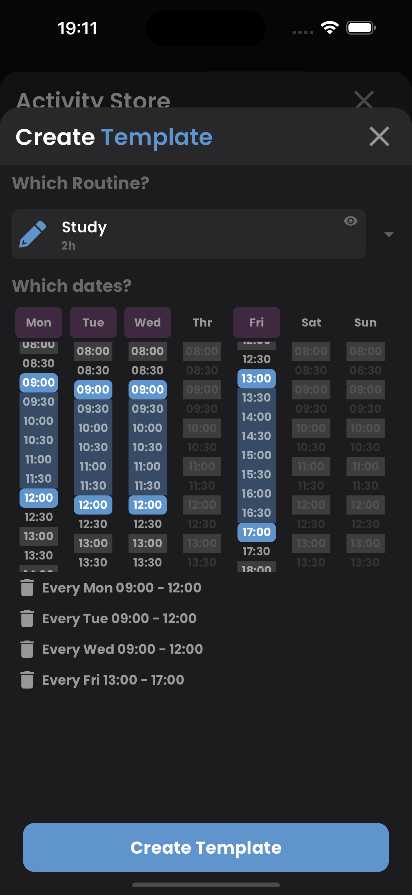
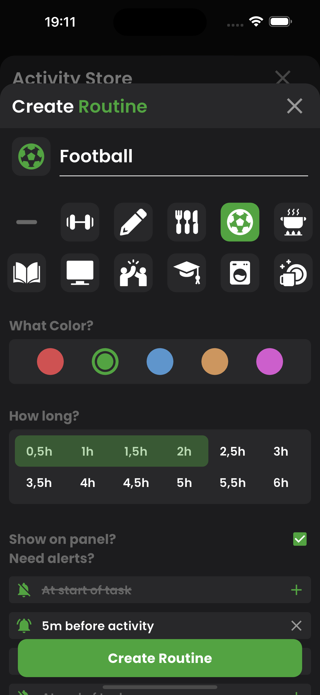
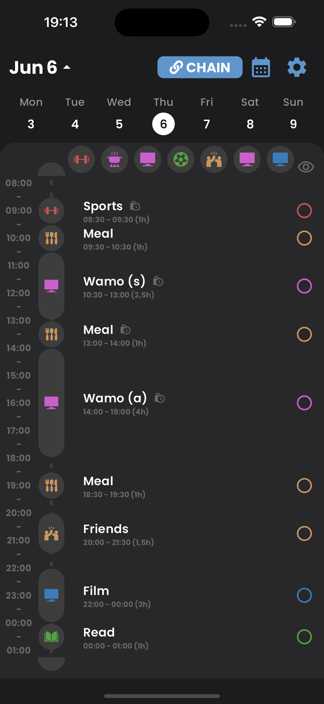

# [Chain](https://chain-af4e5.web.app/)

Chain is a productivity application designed to help you plan your day by creating activities and routines. It is built using Flutter, enabling seamless deployment across web and mobile platforms.

## Features

- **Activity Planning**: Easily create and manage daily activities.
- **Routine Management**: Prepare routines to place them quickly.
- **Template Management**: Create templates for pre-defined activities like working or school hours..
- **Cross-Platform**: Consistent experience on both web and mobile devices.

## Screenshots

<div style="display:flex; width: 100%;">
    
    
    
</div>
## Installation

## Web
Access the web version of Chain [here](https://chain-af4e5.web.app/).

## Mobile
1. Clone the repository:
```bash
git clone https://github.com/yourusername/chain.git
```
2. Navigate to the project directory:
```bash
cd chain
```

3. Install Dependencies
```bash
flutter pub get
```

4. Run the app on your preferred device:
```bash
flutter run
```

## Detected Bugs

- Activity Store models are not aligning properly (Web).
- When the icon is changed while creating an activity, the title also changes if it is already filled.

## Contact

For more information, feel free to reach out at merakserhat@gmail.com.
